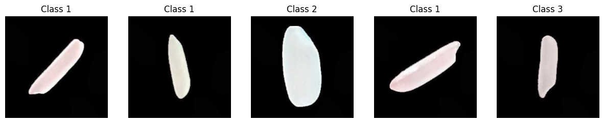

# Rice Image Classification using SVM and Random Forest 

## Introduction
Rice classification is a crucial task with applications in agriculture and food industries. Accurate classification of different rice varieties is essential for quality control and product differentiation. This project aims to build and evaluate classification models, specifically Support Vector Machine (SVM) and Random Forest, for the task of rice image classification.

## Dataset used
The dataset used is Muratkoklu Rice Images dataset which comprises of Arborio, Basmati, Ipsala, Jasmine and Karacadag which are five different varieties of rice often grown in Turkey, were used. The dataset has 75K images including 15K pieces from each rice variety. 
Link to the dataset - https://www.muratkoklu.com/datasets/

## Dataset Images
A preview of random images

## Dependencies
tensorflow: For one-hot encoding. 
skimage: For Local Binary Pattern (LBP) feature extraction. 
sklearn: For SVM, Random Forest, metrics, and other utilities. 
matplotlib: For plotting images and visualizations. 
numpy: For array manipulation. 
os, cv2, PIL: For handling images and basic image processing. 
random: For random sampling. 

## Working of the code
The code performs rice image classification using Support Vector Machine (SVM) and Random Forest algorithms. It loads and preprocesses rice images from different varieties (only 3000 images from each variety is loaded), extracts Local Binary Pattern (LBP) features to capture texture information, and splits the dataset for training and testing. The SVM and Random Forest models are trained, achieving accuracies of 97.5% and 95.27%, respectively. The models are evaluated using metrics such as precision, recall, and F1-score, with classification reports and confusion matrices generated. The script showcases effective rice classification, emphasizing the role of LBP in texture analysis. Trained models are saved for future use, providing a robust solution for rice variety identification. 
Saved model link - https://drive.google.com/drive/u/1/folders/1naQLuts7fE1QyX22Z7n1CmjWw3hPO7T5 
This is done for a Mini Project for my Data Science Lab. 
The base code is taken from Kaggle https://www.kaggle.com/code/arifhasan23/image-processing-lbp-hough-hog-svm-rf-99 
Credits to Md Arif Hasan

